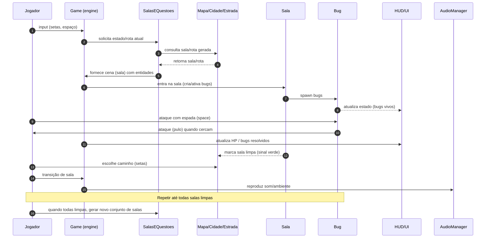

# 🎮 Depurador

Depurador é um roguelike de ação/aventura com estética eletrônica: o jogador
é um agente — o Depurador — que percorre um circuito eletrônico procedural e
entra em componentes (salas) infestados por bugs (falhas) que devem ser
eliminados para restaurar o fluxo do circuito.

---

## Conceito e objetivo

- Tema: o jogador percorre um circuito eletrônico procedural e entra em
  componentes (como ICs, capacitores, chips) que funcionam como salas.
- Objetivo: eliminar bugs (falhas) dentro dos componentes para restaurar
  o circuito e avançar para novos componentes gerados proceduralmente.

## Mecânicas principais (resumo)

- O jogador move-se em um grid de células dentro de cada componente (sala).
- Ao escolher uma rota no circuito, o jogador viaja por trilhas (estradas)
  e chega a um componente destino.
- Cada componente contém 3 bugs por padrão; ao eliminar os 3, o componente
  é marcado como limpo no mapa (sinal verde) e o jogador recupera HP.
- Ao limpar todas as salas de um conjunto, sair para seguir viagem gera um
  novo conjunto de componentes (progressão roguelike).

## Regras de combate e movimento

- Movimento: jogador gira com setas esquerda/direita e caminha com setas
  cima/baixo na direção atual; movimentação por células (ex.: 32x32 px).
- Ataque: tecla Espaço — a espada atinge uma área de 3 células à frente
  (esquerda, centro, direita). Cada acerto causa 1 de dano; bugs morrem
  após 3 acertos.
- Bugs: aguardam no centro do componente até o jogador atravessar a área
  de porta pequena; ao fazê-lo, os bugs cercam e atacam (pulo), causando 1
  de dano ao jogador e retornando para uma célula aleatória.
- HP: jogador tem 10 de HP máximo; ao limpar um componente, HP é restaurado.
  Se HP chegar a 0, o jogador é expulso do componente (teleportado para
  posição anterior) e deve seguir adiante.

## Estrutura do circuito e geração

- Cada conjunto contém 5 componentes iniciais, conectados por caminhos com
  até 3 nós entre componentes.
- Componentes são gerados proceduralmente e são convexos com 35 células cada
  (áreas navegáveis dentro do componente).
- Ao limpar todas as componentes do conjunto, sair para outra gera 4 novos
  componentes com 3 bugs cada.

## Interface e áudio

- HUD exibe HP e número de bugs resolvidos.
- Música ambiente e efeitos para ataques, jumps de bugs, e sinais de limpeza.

## Controles

- ← / → : girar o ângulo do jogador
- ↑ / ↓ : mover para frente / para trás
- Espaço : atacar (área de 3 células à frente)

## Requisitos técnicos mínimos

- Python 3.10+ (recomendado)
- Pygame / Pygame Zero para render, input e áudio
- Sistema de geração procedural para componentes (algoritmo de salas
  convexas com N células)
- Grid e física simples para movimentação por células e colisões

---

Se quiser, eu adapto o diagrama para UML de classes, diagrama de estados do
combate, ou crio um protótipo mínimo da cena de componente com movimentação
e ataque em grid — diga qual prefere que eu faça a seguir.
# 🎮 SSBJr.Kodland.PgZero

## Visão geral do projeto: Depurador

Este repositório contém uma base para um jogo estilo roguelike chamado
"Depurador": o personagem explora uma cidade procedural atacada por
bugs, percorre estradas com bifurcações e entra em salas geradas proceduralmente
para eliminar inimigos.

---

## Diagrama de interação (Mermaid)

Copie e cole o bloco abaixo em um renderizador que suporte Mermaid (por
exemplo, o preview do VS Code com extensão) para visualizar o diagrama.

---

## Requisitos do jogo (descrição detalhada)

Contexto geral:
- O personagem está em uma cidade procedural que está sendo atacada por bugs.
- O estilo é roguelike: geração procedural de salas e progressão por limpeza delas.

Mundo e navegação:
- O jogador percorre estradas com bifurcações usando as setas do teclado.
- Ao escolher uma rota, o jogador viaja até uma das cinco salas geradas
  proceduralmente. Cada sala é separada por caminhos distintos com até três
  nós de distância.
- Quando o jogador sai da porta pequena da sala para o corredor, os bugs
  na sala aguardam; ao ele atravessar essa área pequena, os bugs cercam e
  atacam o jogador.

Salas e combate:
- Cada sala é convexa e contém exatamente 35 células (grid) para movimentação.
- O jogador se move por células; pode andar livremente entre células vazias.
- O jogador usa as teclas laterais para girar o ângulo (direita/esquerda) e as
  verticais para mover para frente/para trás em relação ao ângulo atual.
- A espada atinge uma área à frente de 3 células (esquerda, centro, direita).
- O jogador pressiona Espaço para atacar; cada acerto em um bug causa 1 dano ao
  bug. Quando um bug recebe 3 acertos, ele é destruído.
- Cada sala contém 3 bugs inicialmente; ao matar os 3 bugs da sala, a sala é
  marcada como limpa (sinal verde no mapa) e o jogador recupera HP completo
  (10 HP máximo).
- Os bugs causam 1 de dano ao jogador ao acertarem o pulo, e depois retornam a
  um bloco aleatório na sala. Se o HP do jogador chegar a zero, ele é retirado
  da sala (teleportado para início do caminho ou sala anterior) e pode seguir
  para outra sala (com penalidade definida pelo jogo).

Progressão e geração:
- Quando o jogador limpa todas as salas existentes (por exemplo, as 5 atuais),
  ao sair para seguir para outra sala, o sistema gera quatro novas salas cada
  uma contendo 3 bugs para eliminar — a progressão continua indefinidamente.

IA e comportamento dos bugs:
- Os bugs aguardam no meio da sala até que o jogador saia da pequena área na
  porta.
- Após o jogador sair dessa área, os bugs cercam o jogador e podem pular para
  atacá-lo. Eles podem cercar e atacar simultaneamente (vários bugs atacando
  ao mesmo tempo).

Interface e áudio:
- HUD mostra HP do jogador e contagem de bugs resolvidos.
- Há música ambiente contínua e efeitos sonoros para jogador e bugs.

Controles (resumido):
- Setas esquerda/direita: girar o ângulo do jogador.
- Setas cima/baixo: andar para frente/para trás segundo o ângulo.
- Espaço: atacar com a espada (área de 3 células na frente).

Regras de dano e vida:
- Jogador: HP máximo 10. Ao limpar uma sala, HP restaura para o máximo.
- Bug: precisa de 3 acertos para morrer; cada acerto do bug no jogador causa 1
  de dano.

Requisitos técnicos mínimos:
- Motor: Pygame/Pygame Zero para render e input.
- Grid: representação em células (tamanho configurável, p.ex. 32x32 px).
- Sistema de geração procedural para salas convexas de 35 células e suas
  conexões (estradas com até 3 nós entre salas).
- Sistema de áudio (música ambiente e efeitos de impacto).

Critérios de aceitação (versão mínima jogável):
1. O jogador pode se mover por células e atacar com a espada.
2. Salas são geradas proceduralmente com 35 células e 3 bugs cada.
3. Bugs aguardam até o jogador sair da área da porta; então cercam e atacam.
4. Ao eliminar todos os bugs de uma sala, ela aparece como limpa no mapa e o
   jogador recupera HP.
5. Ao limpar todas as salas ativas e sair para seguir viagem, novo conjunto de
   salas é gerado.

---

Se quiser, posso também gerar um diagrama de classes (UML simplificado) ou um
diagrama de estados para o fluxo de combate — diga qual prefere a seguir.
# 🎮 SSBJr.Kodland.PgZero