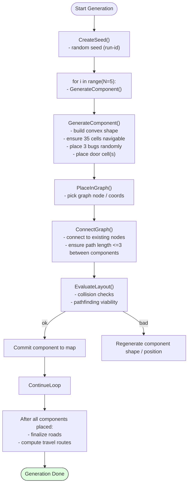

## Geração procedural (Blueprint-like)

Descreve a lógica que constrói conjuntos de componentes (salas convexas de 35
células) e as conecta por estradas com até 3 nós entre componentes.

Observações:
- A geração prioriza conectividade e restrições de distância (até 3 nós).
- Componentes devem ser convexos e ter exatamente 35 células úteis para
  navegação.
