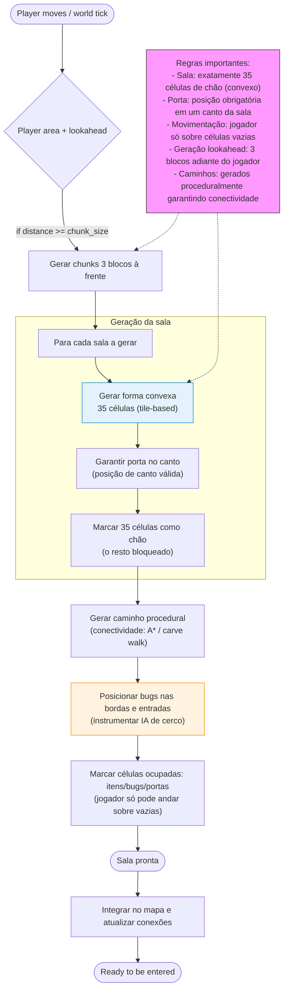
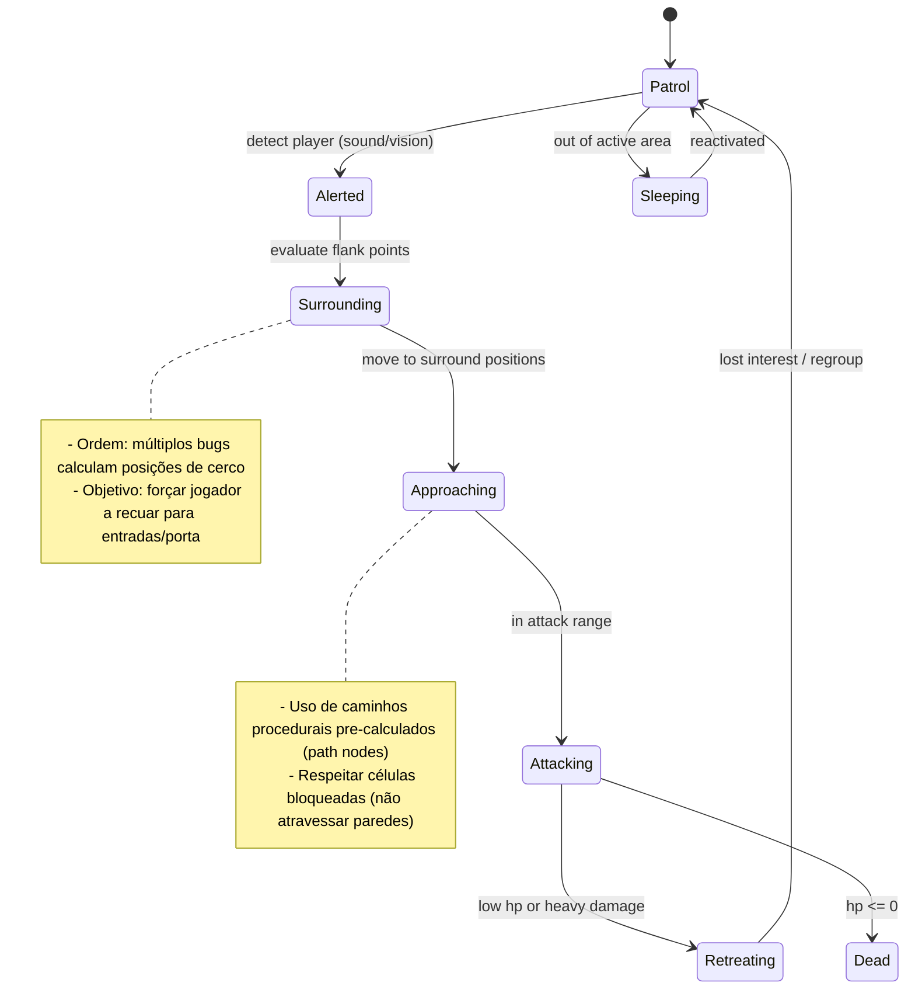

````markdown
## Geração procedural de salas (forma convexa de 35 células) e IA de bugs

Diagrama que descreve a pipeline de geração procedural de salas com piso
composto por 35 células em formato convexo, caminhos procedurais conectando
o jogador às salas, regras de movimento (jogador só anda sobre células vazias),
porta posicionada no canto da sala e geração ocorrendo 3 blocos adiante da
área do jogador. Inclui também um diagrama de máquina de estados para a IA dos
bugs (cerco + ataque).





Breve explicação
- A pipeline gera chunks (blocos) adiante do jogador (lookahead = 3) e monta
  salas com 35 células em formato convexo — isso garante salas de tamanho
  controlado e previsível, porém com variação de forma.
- Cada sala tem uma porta posicionada em um dos cantos; os caminhos são
  esculpidos proceduralmente para conectar o jogador à porta/entrada.
- Bugs têm uma máquina de estados que prioriza cerco (surround) e depois ataque;
  movimento e IA respeitam o mapa de células para evitar atravessar paredes.

````
