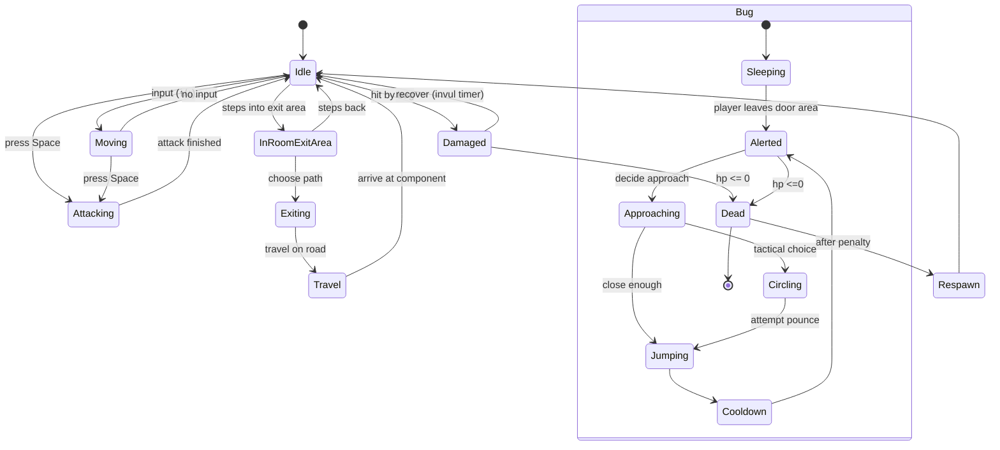

## Máquinas de estado: Jogador e Bug

Diagrama em Mermaid mostrando estados e transições para o jogador e para os
bugs (inimigos).

Explicação:
- Jogador tem estados básicos de movimento/ataque/dano/respawn.
- Bugs começam dormindo, são alertados quando o jogador sai da área da porta
  e então executam táticas (approach/circle/jump) até morrerem.
