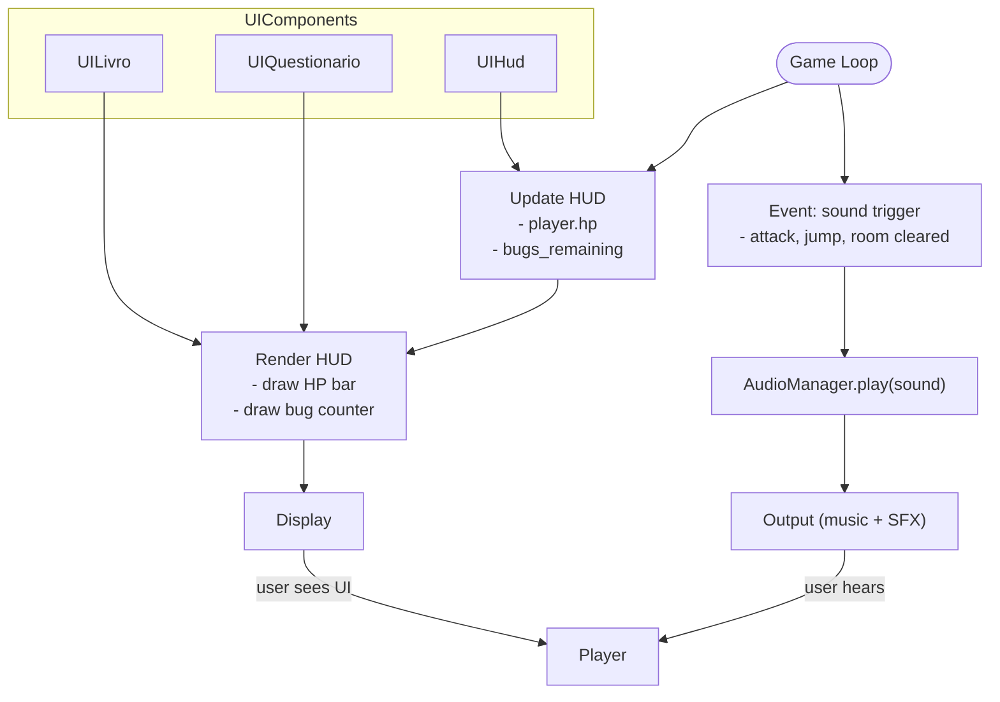

## UI e Audio (Blueprint-like)

Diagrama resumido mostrando como a UI e o sistema de áudio se conectam ao
gameplay para atualizar HUD e tocar sons.

Notas:
- `AudioManager` gerencia canais de música/efeitos e suporta volume/mute.
- UI componentes são leves e recebem estados (player, sala) para renderizar.
