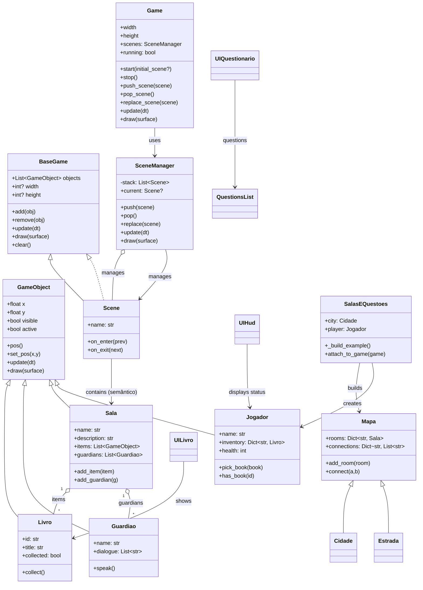

## Diagrama de classes (Mermaid)

O diagrama abaixo representa as principais classes implementadas em
`src/game` e `src/game/entities.py`, com heranças e relações principais.

Cole o bloco em um renderizador que suporte Mermaid para visualizar.

Breve explicação
- Herança: `GameObject` é pai de entidades que existem na cena (jogador, sala,
  guardiões, livros). `BaseGame` é pai de `Scene`.
- Composição: `Sala` contém `items` (por exemplo `Livro`) e `guardians`.
- `SalasEQuestoes`/`DepuradorProject` monta o `Mapa` e o `Jogador` e injeta no
  `Game` para iniciar a experiência.